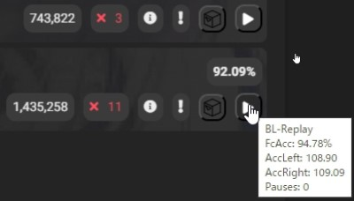

[README(日本語)](README_JP.md)

# About

This is a modified version of the script that adds ACC to unranked scores on [Score Saber](https://scoresaber.com) website. This version additionally fetches score data including ReplayId from the [BeatLeader](https://www.beatleader.xyz/) API to generate replay links. The [original script](https://github.com/motzel/scoresaber-unranked-acc) was created by [motzel](https://github.com/motzel), and this modified version was created by hatopopvr.

## Installation

Get Tampermonkey for [Chrome/Edge Chromium](https://chrome.google.com/webstore/detail/tampermonkey/dhdgffkkebhmkfjojejmpbldmpobfkfo). Then install the script from [here](https://github.com/hatopopvr/scoresaber-enhanced-bl-replays/raw/master/scoresaber-enhanced-bl-replays.user.js).

**Note:** This modified version of the script has only been tested in Chrome. While it may work in other browsers, there may be unexpected issues.

## Known Issues

This script may encounter issues with CORS (Cross-Origin Resource Sharing) policy, preventing it from fetching data from the BeatLeader API. A possible workaround for this issue is to use a browser extension that allows CORS, such as [CORS Unblock for Chrome](https://chrome.google.com/webstore/detail/cors-unblock/lfhmikememgdcahcdlaciloancbhjino).

## Data Storage

This script utilizes the local storage functionality provided by Tampermonkey to cache each score's BeatLeader score data. This is done to reduce the number of requests made to the BeatLeader API, thereby enhancing the script's performance. The data stored includes the following properties of each score:

- Left hand accuracy (accLeft)
- Right hand accuracy (accRight)
- Replay id (id)
- Accuracy (accuracy)
- Full combo accuracy (fcAccuracy)
- Number of bad cuts (badCuts)
- Number of missed notes (missedNotes)
- Number of bomb cuts (bombCuts)
- Number of wall hits (wallHit)
- Number of pauses (pauses)
- Score improvement (scoreImprovement)

In addition, playerId, hash, difficulty, modifiedScore, and mode of each score are stored. This data is used solely for the purpose of facilitating the functionality of this script and is not shared with any other scripts or services.