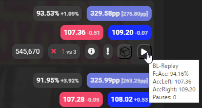
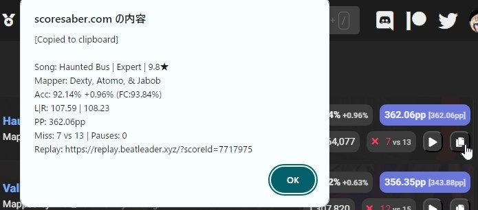

[README(日本語)](README_JP.md)

# About

This is a modified version of the script that adds ACC to unranked scores on [Score Saber](https://scoresaber.com) website. This version additionally fetches score data including ReplayId from the [BeatLeader](https://www.beatleader.xyz/) API, generating replay links and providing the additional information shown below. The [original script](https://github.com/motzel/scoresaber-unranked-acc) was created by [motzel](https://github.com/motzel), and this modified version is being developed and maintained by hatopopvr.

## New Feature: Clipboard Copy Customization (Added in v0.4.0)
A new feature added to this modified version allows users to quickly copy and share score information to the clipboard. This information includes the song name, mapper name, difficulty, ACC, PP, and replay link, among other details. Furthermore, the format of this copied information can be customized by the user.

To customize the format, users need to edit the format settings defined within the script's source code. This capability allows users to adjust how information is displayed according to their preferences, such as emphasizing certain details or omitting unnecessary information.

A list of customizable variables and their descriptions can be found in the comments within the script. If you wish to make changes, use these variables to set up your desired format. For detailed instructions and examples, please refer to the comments within the script.

## Installation

Get Tampermonkey for [Chrome/Edge Chromium](https://chrome.google.com/webstore/detail/tampermonkey/dhdgffkkebhmkfjojejmpbldmpobfkfo). Then install the script from [here](https://github.com/hatopopvr/scoresaber-enhanced-bl-replays/raw/master/scoresaber-enhanced-bl-replays.user.js).

**Note:** This modified version of the script has only been tested in Chrome. While it may work in other browsers, there may be unexpected issues.

## Known Issues

This script may encounter issues with CORS (Cross-Origin Resource Sharing) policy, preventing it from fetching data from the BeatLeader API. A possible workaround for this issue is to use a browser extension that allows CORS, such as [CORS Unblock for Chrome](https://chrome.google.com/webstore/detail/cors-unblock/lfhmikememgdcahcdlaciloancbhjino).

## Data Storage

This script utilizes the local storage functionality provided by Tampermonkey to cache each score's BeatLeader score data. This is done to reduce the number of requests made to the BeatLeader API, thereby enhancing the script's performance. The data stored includes the following properties of each score:

- Left hand accuracy (accLeft)
- Right hand accuracy (accRight)
- Replay id (id)
- Accuracy (accuracy)
- Full combo accuracy (fcAccuracy)
- Number of bad cuts (badCuts)
- Number of missed notes (missedNotes)
- Number of bomb cuts (bombCuts)
- Number of wall hits (wallHit)
- Number of pauses (pauses)
- Score improvement (scoreImprovement)

In addition, playerId, hash, difficulty, modifiedScore, and mode of each score are stored. This data is used solely for the purpose of facilitating the functionality of this script and is not shared with any other scripts or services.

## Disclaimer

This script requires the use of a browser extension such as [CORS Unblock for Chrome](https://chrome.google.com/webstore/detail/cors-unblock/lfhmikememgdcahcdlaciloancbhjino) to loosen the CORS (Cross-Origin Resource Sharing) policy. As a result, your browser's security may be reduced more than usual. By using this script, you agree to accept this risk.

Moreover, the author of this script shall not be liable for any potential damage that may arise from the use of the script. It is assumed that the user fully understands all risks associated with using the script and agrees to use it at their own risk.