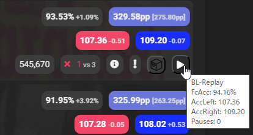

[English version of this README](README.md)

# About

[Score Saber](https://scoresaber.com) のウェブサイトでアンランクのスコアにACCを追加するスクリプト scoresaber-unranked-acc の改造版です。このバージョンでは、[BeatLeader](https://www.beatleader.xyz/) API からBeatLeaderのReplayIdを含むスコアデータを取得し、リプレイリンクの生成と、以下画像の追加情報を提供します。[オリジナルのスクリプト](https://github.com/motzel/scoresaber-unranked-acc) は [motzel](https://github.com/motzel) 氏によって作成され、この改造版は hatopopvr によって開発・メンテナンスが行われています。

## 新機能: クリップボードコピーのカスタマイズ
この改造版には、スコア情報をクリップボードにコピーする新機能が追加されました。この機能により、曲名、Mapper名、難易度、ACC、PP、リプレイリンクなど、スコアに関する情報をすばやくコピーして共有することが可能になります。さらに、このコピーされる情報のフォーマットは、ユーザーによってカスタマイズすることができます。

フォーマットをカスタマイズするには、スクリプトのソースコード内にあるフォーマット設定を編集してください。この機能により、表示したい情報の形式を自由に調整できます。例えば、特定の情報を強調したり、必要でない情報を省略することが可能です。

カスタマイズ可能な変数の一覧とその説明は、スクリプト内のコメント部に記述されています。変更を加えたい場合は、これらの変数を用いて希望するフォーマットに設定してください。詳しい手順や例については、スクリプト内のコメントを参照してください。

## インストール方法

まず、[Chrome/Edge Chromium 用の Tampermonkey](https://chrome.google.com/webstore/detail/tampermonkey/dhdgffkkebhmkfjojejmpbldmpobfkfo) を入手します。次に、[こちら](https://github.com/hatopopvr/scoresaber-enhanced-bl-replays/raw/master/scoresaber-enhanced-bl-replays.user.js) からスクリプトをインストールします。

**注意:** この改造版のスクリプトは Chrome でのみテストされています。他のブラウザでも動作するかもしれませんが、予期しない問題が発生する可能性があります。

## 既知の問題

このスクリプトは、CORS (Cross-Origin Resource Sharing) ポリシーの制約により、BeatLeader API からデータを取得できない問題があります。[CORS Unblock for Chrome](https://chrome.google.com/webstore/detail/cors-unblock/lfhmikememgdcahcdlaciloancbhjino) などのCORSを許可するブラウザ拡張機能を使用するなどして、この問題の回避する必要があります。

## データ保存について

本スクリプトは、Tampermonkeyが提供するローカルストレージ機能を利用し、各スコアのBeatLeaderから取得したスコアデータをキャッシュとして保存します。これは、BeatLeader APIへのリクエスト数を減らし、スクリプトのパフォーマンスを向上させるためのものです。保存されるデータには以下の項目が含まれます：

- Left hand accuracy (accLeft)
- Right hand accuracy (accRight)
- Replay id (id)
- Accuracy (accuracy)
- Full combo accuracy (fcAccuracy)
- Number of bad cuts (badCuts)
- Number of missed notes (missedNotes)
- Number of bomb cuts (bombCuts)
- Number of wall hits (wallHit)
- Number of pauses (pauses)
- Score improvement (scoreImprovement)

さらに、各スコアのplayerId、hash、difficulty、modifiedScore、modeも保存されます。これらのデータは、本スクリプトの機能を実現するためだけに使用され、他のスクリプトやサービスと共有されることはありません。

## 免責事項

本スクリプトは、[CORS Unblock for Chrome](https://chrome.google.com/webstore/detail/cors-unblock/lfhmikememgdcahcdlaciloancbhjino) などのブラウザ拡張機能を使用して、CORS (Cross-Origin Resource Sharing) ポリシーを緩和することを必要とします。これにより、あなたのブラウザは通常よりもセキュリティが低下する可能性があります。このスクリプトを使用することで、そのリスクを受け入れることに同意したものとします。

また、スクリプトの作者は、スクリプトの使用により生じる可能性のあるいかなる損害に対しても責任を負いません。ユーザー自身がスクリプトを使用する際のリスクを全て理解し、その上で自己責任でスクリプトを使用することを同意したものとみなします。